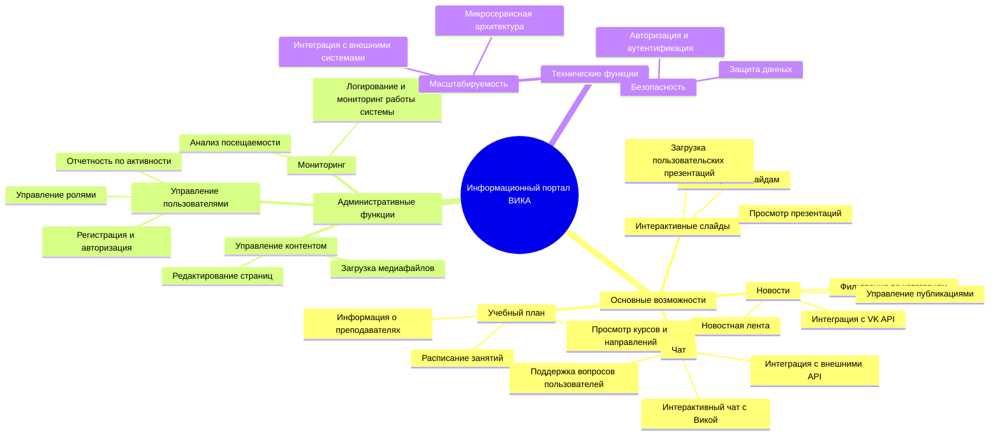
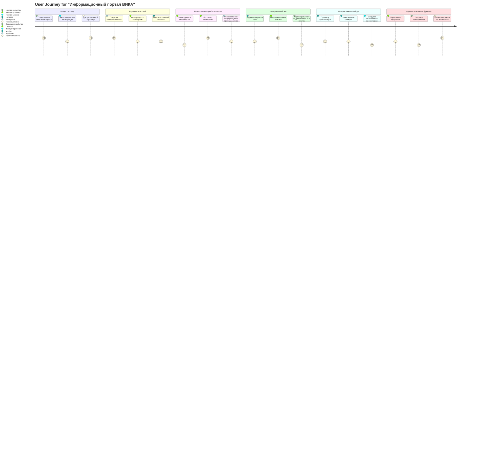
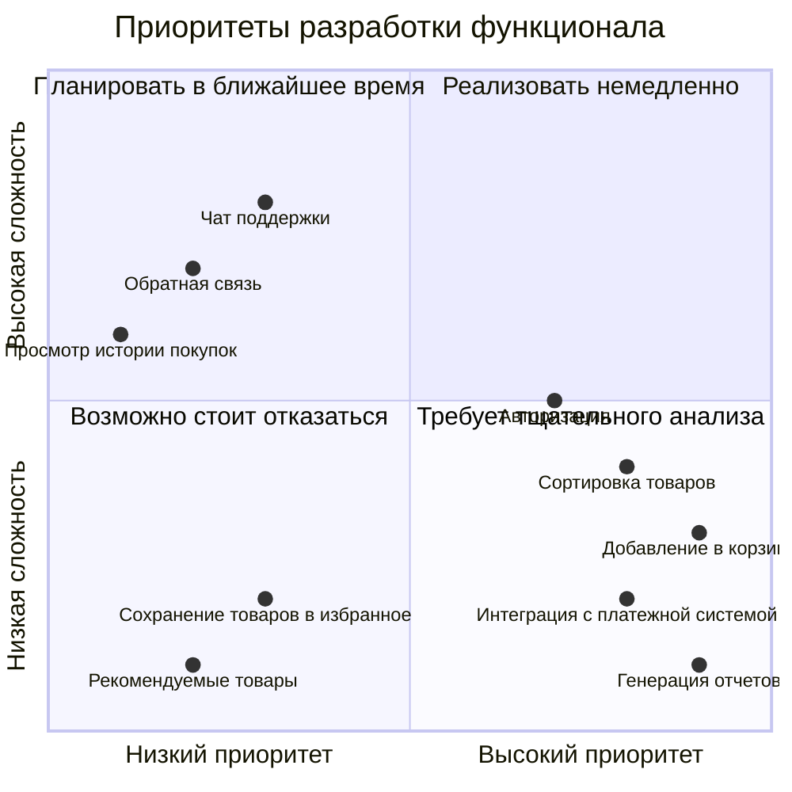
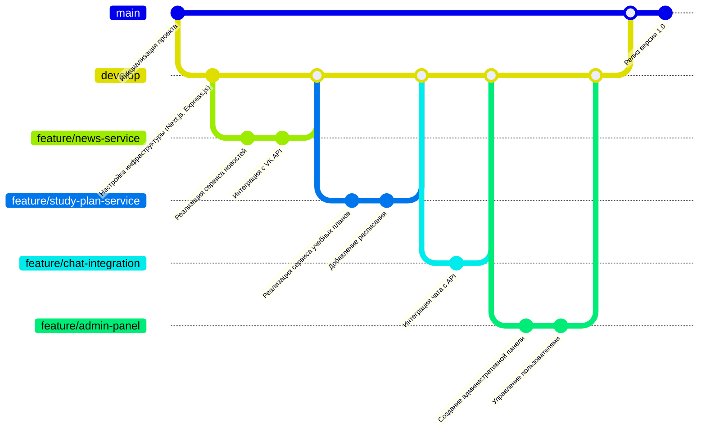

```mermaid
mindmap
  root((Информационный портал ВИКА))
    Основные возможности
      Новости
        Новостная лента
        Фильтрация по категориям
        Интеграция с VK API
        Управление публикациями
      Учебный план
        Просмотр курсов и направлений
        Расписание занятий
        Информация о преподавателях
      Чат
        Интерактивный чат с Викой
        Поддержка вопросов пользователей
        Интеграция с внешними API
      Интерактивные слайды
        Просмотр презентаций
        Навигация по слайдам
        Загрузка пользовательских презентаций
    Административные функции
      Управление пользователями
        Регистрация и авторизация
        Управление ролями
        Отчетность по активности
      Управление контентом
        Редактирование страниц
        Загрузка медиафайлов
      Мониторинг
        Анализ посещаемости
        Логирование и мониторинг работы системы
    Технические функции
      Масштабируемость
        Микросервисная архитектура
        Интеграция с внешними системами
      Безопасность
        Авторизация и аутентификация
        Защита данных
```

```mermaid
journey
    title User Journey for "Информационный портал ВИКА"
    section Вход в систему
      Пользователь открывает портал: 5: Ожидание удобства
      Авторизация или регистрация: 4: Иногда сложно
      Доступ к главной странице: 5: Удовлетворение
    section Изучение новостей
      Открытие новостной ленты: 5: Удобство
      Фильтрация по категориям: 4: Полезно
      Просмотр полной новости: 4: Интерес
    section Использование учебного плана
      Поиск курсов и направлений: 3: Иногда путаница
      Просмотр расписания: 5: Полезно
      Ознакомление с информацией о преподавателях: 4: Интересно
    section Интерактивный чат
      Задание вопроса в чате: 4: Удобно
      Получение ответа от Вики: 5: Полезно
      Перенаправление на дополнительный ресурс: 3: Иногда неудобно
    section Интерактивные слайды
      Просмотр презентаций: 4: Интерес
      Навигация по слайдам: 4: Удобно
      Загрузка собственной презентации: 3: Требует времени
    section Административные функции
      Управление профилем: 4: Полезно
      Загрузка медиафайлов: 3: Иногда неудобно
      Проверка отчетов по активности: 5: Информативно
```

```mermaid
    quadrantChart
        title Приоритеты разработки функционала
        x-axis "Низкий приоритет" --> "Высокий приоритет"
        y-axis "Низкая сложность" --> "Высокая сложность"
        quadrant-1 "Реализовать немедленно"
        quadrant-2 "Планировать в ближайшее время"
        quadrant-3 "Возможно стоит отказаться"
        quadrant-4 "Требует тщательного анализа"

        "Чат поддержки": [0.3, 0.8]
        "Обратная связь": [0.2, 0.7]
        "Просмотр истории покупок": [0.1, 0.6]

        "Генерация отчетов": [0.9, 0.1]
        "Интеграция с платежной системой": [0.8, 0.2]

        "Добавление в корзину": [0.9, 0.3]
        "Сортировка товаров": [0.8, 0.4]
        "Авторизация": [0.7, 0.5]

        "Рекомендуемые товары": [0.2, 0.1]
        "Сохранение товаров в избранное": [0.3, 0.2]

```

```mermaid
gitGraph
   commit id: "Инициализация проекта"
   branch develop
   checkout develop
   commit id: "Настройка инфраструктуры (Next.js, Express.js)"
   branch feature/news-service
   checkout feature/news-service
   commit id: "Реализация сервиса новостей"
   commit id: "Интеграция с VK API"
   checkout develop
   merge feature/news-service
   branch feature/study-plan-service
   checkout feature/study-plan-service
   commit id: "Реализация сервиса учебных планов"
   commit id: "Добавление расписания"
   checkout develop
   merge feature/study-plan-service
   branch feature/chat-integration
   checkout feature/chat-integration
   commit id: "Интеграция чата с API"
   checkout develop
   merge feature/chat-integration
   branch feature/admin-panel
   checkout feature/admin-panel
   commit id: "Создание административной панели"
   commit id: "Управление пользователями"
   checkout develop
   merge feature/admin-panel
   checkout main
   merge develop
   commit id: "Релиз версии 1.0"
```